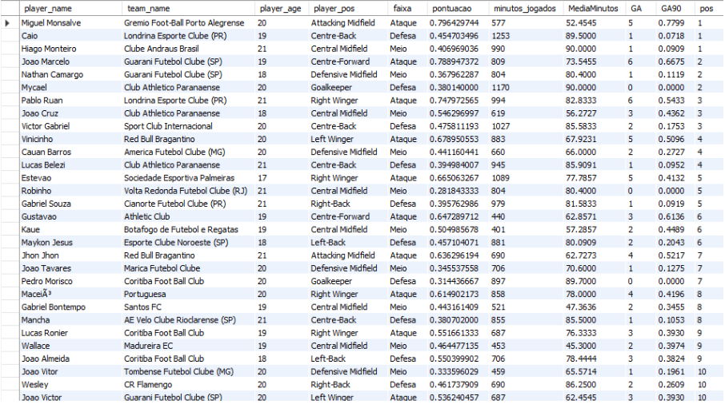

# Estaduais 2025

Projeto voltado à extração, tratamento e análise de dados dos principais campeonatos estaduais do futebol brasileiro em 2025.

## Objetivo

- Praticar extração de dados oriundos da web;
- Aplicar técnicas de limpeza e análise de dados em SQL;
- Construir rankings e métricas para avaliação de jogadores sub-21.

## Stack

- R (`worldfootballR`)
- Excel
- MySQL
- Power BI
# Estrutura da base

Exemplo da estrutura dos dados após extração e consolidação:

```text
team_name                     Divisão       Estadual   player_name      player_pos            player_age   goals   assists   minutes_played
Bangu Atletico Clube (RJ)    Sem divisao   Carioca    Joao Veras      Centre-Forward        23           2       0         496
Bangu Atletico Clube (RJ)    Sem divisao   Carioca    Joao Felipe     Defensive Midfield    22           1       0         580
Bangu Atletico Clube (RJ)    Sem divisao   Carioca    Victor Brasil   Goalkeeper            31           0       0         900
Bangu Atletico Clube (RJ)    Sem divisao   Carioca    Marlon          Left-Back             31           0       0          85
Bangu Atletico Clube (RJ)    Sem divisao   Carioca    Italo           Left-Back             23           0       1         725
```

Colunas presentes na base:

- Informações do clube e campeonato;
- Dados demográficos dos jogadores;
- Posição em campo;
- Estatísticas ofensivas;
- Minutagem e participação em partidas;
- Dados disciplinares e substituições.


## Pipeline do projeto

- Exploração de diferentes fontes públicas de dados esportivos;
- Extração automatizada de dados do Transfermarkt;
- Adaptação de funções da biblioteca `worldfootballR` para incluir estatísticas detalhadas;
- Consolidação dos dados dos estaduais Paulista, Carioca, Mineiro, Gaúcho e Paranaense;
- Limpeza, padronização e tratamento dos dados para análise;
- Criação de queries SQL para ranking e segmentação dos jogadores;

# Query SQL

A query utilizada para criação do ranking segmentado por faixa do campo está disponível em:

```text
/sql/ranking_sub21.sql
```

Trecho da lógica utilizada:

```sql
RANK() OVER (
    PARTITION BY faixa
    ORDER BY pontuacao DESC
)
```

---

# Resultado da query

Output do ranking de jogadores sub-21 após normalização das métricas:



---
## Limitações da base

A base de dados possui foco principalmente em estatísticas ofensivas, com métricas como gols, assistências, minutos jogados e participações em partidas. Isso limita análises mais profundas para posições defensivas, já que não há dados detalhados de ações sem bola, desarmes, interceptações ou métricas avançadas de desempenho.

Por conta disso, a avaliação de jogadores defensivos foi baseada principalmente em relevância dentro da equipe, utilizando critérios como minutos jogados, média de minutos e frequência como titular.

## Principais análises

- Ranking de jogadores sub-21 por faixa do campo;
- Métricas ponderadas de participação ofensiva por 90 minutos;
- Normalização de indicadores para reduzir distorções causadas por volume de minutos;
- Segmentação entre ataque, meio e defesa utilizando SQL.

## Técnicas utilizadas em SQL

- CTEs
- `CASE WHEN`
- `RANK()`
- `PARTITION BY`
- Agregações
- Normalização de métricas
- Filtros por idade e minutagem


## Próximos passos

- Ampliação das análises para todos os jogadores;

